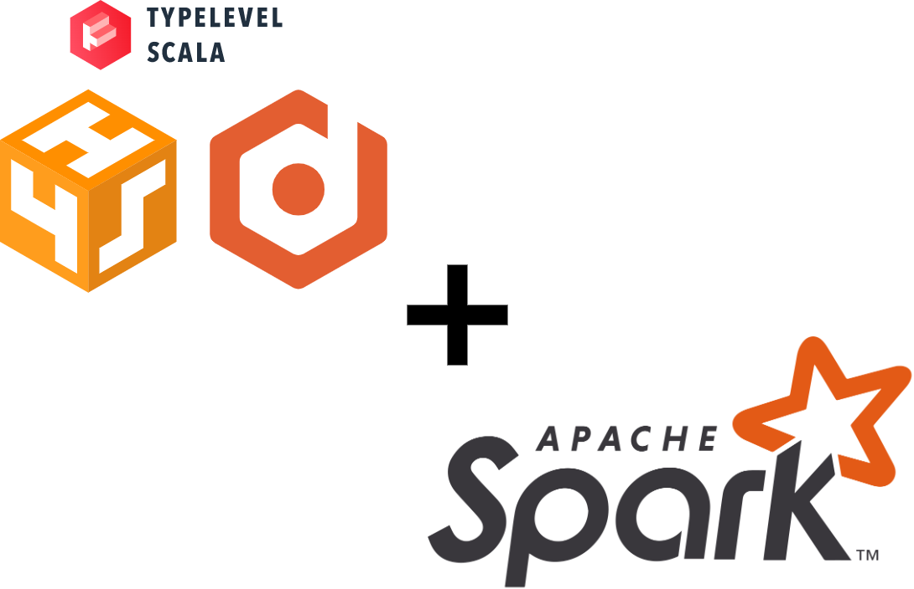

# EasyEDA - Easy exploratory data analysis

📊😌 **EasyEDA** is a REST API for doing common exploratory data analysis.
It is powered by Typelevel microservice stack **[http4s](https://http4s.org/v0.23/docs/quickstart.html)**
and **[Doobie](https://tpolecat.github.io/doobie/)** (with **[Cats IO](https://typelevel.org/cats-effect/)**)
plus **[Spark](https://spark.apache.org/docs/3.3.3/)**
providing fast asynchronous parallel request processing and **in-memory** data computation.
It means none of your source data are saved somewhere plus everything are done on the fly 🚀🤩!

# Want to contribute ? 😉

- [Stack used image](docs/stackUsed.png) can be directly modified via [draw.io](https://app.diagrams.net/)
- [IntelliJ IDEA CE](https://www.jetbrains.com/idea/) was used to build the source code part
- This [VSCode extension](https://marketplace.visualstudio.com/items?itemName=42Crunch.vscode-openapi) was used to edit the [OpenAPI documentation](src/main/resources/swagger/openapi.yaml)

# Logbook (🙏😣 Work still in progress...)

- Continue with dev on preview
  - UTs for ReadStream (😼 TODO currently HERE 😼)
    - Make the UT1 work (Equal display but not equal ?!)
- Building whole execution of preview
  - Job will be launched without saving to DBs for the moment
- Implement e2e exception handling with proper `EitherT[IO, Throwable, A]`
- Think about cron jobs not terminated but still here sessions ?
  - K8S stateless compatibility too be-careful ⚠️
    - The implementation of "not-continue"
- Work on Logging (Spark logs annoying + No app logging)
- Start DEV on Spark NLP Service

# Notes

- `_.withReceiveBufferSize(256 * 1024)` & `_.take(2)` both are related. The buffer size is exactly defining how many
elements you have in your `Stream[IO, String]`
- User will import everytime its file
  - because don't want to save its data
  - better to not have customParams because not analyzable via SQL or through auto framework